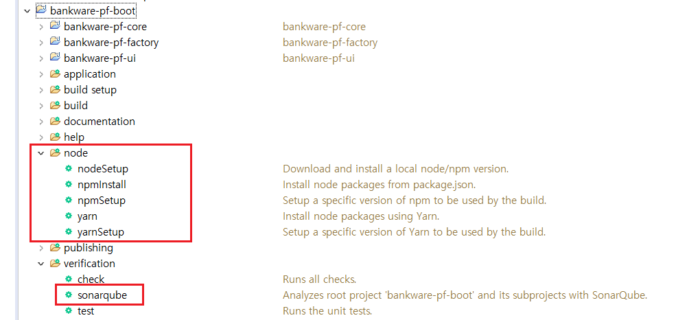

# 의존성 관리 응용

### 최상위 프로젝트와 하위 프로젝트 Include


```groovy
// settings.gradle
rootProject.name = 'bankware-pf-boot'

include ':bankware-pf-core'
project(':bankware-pf-core').projectDir = new File("../../prod/bankware-pf-core")

include ':bankware-pf-factory'
project(':bankware-pf-factory').projectDir = new File("../../prod/bankware-pf-factory")

include ':bankware-pf-ui'
project(':bankware-pf-ui').projectDir = new File("../../prod/bankware-pf-ui")
```

### 모든 하위 프로젝트에 공통 설정 넣기


```groovy
// build.gradle
subprojects {
    apply plugin: 'java'
    apply plugin: 'eclipse-wtp'
 
    repositories {
       mavenCentral()
    }
 
    dependencies {
        testCompile 'junit:junit:4.8.2'
    }
 
    version = '1.0'
 
    jar {
        manifest.attributes provider: 'gradle'
    }
}
```


### 프로젝트간 의존성


```groovy
// build.gradle
dependencies {
    // bankware-pf-boot는 core와 factory 프로젝트에 의존하고 있다.
    compile project(':bankware-pf-core')
    compile project(':bankware-pf-factory')
}

```

### 프로젝트 lib 의존성

- 프로젝트간 의존 lib가 중복 정의 되어 있어도 가장 가까운 하나만 build 된다.
- 의존성 유형에 따라 실제 build되는 lib가 달라진다.


---

## PF의 의존성 관리 

### plugins

Spring Boot dependancy 관리와 애플리케이션의 패키징을 도와주는 도구.

plugins에 추가되면 자동으로 gradle task가 생성됨.

```Groovy
plugins {
	id 'org.springframework.boot' version '2.4.2'
	id 'io.spring.dependency-management' version '1.0.11.RELEASE'
	id 'java'
	id 'com.moowork.node' version '1.3.1' // Node script 실행용? Docu 때문인가?
	id 'org.sonarqube' version '3.1.1'  // SonarQube 분석용
}
```



### configurations

```Groovy
configurations {
	compileOnly {
		extendsFrom annotationProcessor // compileOnly에 annotationProcessor를 상속시킴
	}
}
```

### sourceSets

```groovy
sourceSets {
	main {
		java {
			srcDirs = ["src/main/java"]
		}
		resources {
			srcDirs = ["src/main/resources", "${project(':bankware-pf-ui').projectDir}/src/main/resources"]
		}
	}
}
```

### jar

```groovy
jar {
	exclude("application.yml")
}
```

### dependencies

```groovy
dependencies {
	compile project(':bankware-pf-core')
	compile project(':bankware-pf-factory')
	compile 'commons-fileupload:commons-fileupload:1.4'
	implementation 'org.springframework.boot:spring-boot-starter-web'
	implementation 'org.mybatis.spring.boot:mybatis-spring-boot-starter:2.1.4'
	developmentOnly 'org.springframework.boot:spring-boot-devtools'
	compileOnly 'com.oracle.database.jdbc:ojdbc8'
	compileOnly 'mysql:mysql-connector-java'
	runtimeOnly 'org.bgee.log4jdbc-log4j2:log4jdbc-log4j2-jdbc4.1:1.16'
	runtimeOnly 'com.h2database:h2'
	testImplementation 'org.springframework.boot:spring-boot-starter-test'
}
```

- compile project - 프로젝트간 의존성

- compile - 프로젝트 소스를 컴파일 하기 위해 필요한 lib. deprecated 되었고 implementation 혹은 api를 사용해야함
- implementation - 의존 라이브러리 수정시 본 모듈까지만 재빌드. 본 모듈을 의존하는 모듈은 해당 라이브러리의 api 를 사용할 수 없음
- api - 의존 라이브러리 수정시 본 모듈을 의존하는 모듈들도 재빌드. 본 모듈을 의존하는 모듈들도 해당 라이브러리의 api 를 사용할 수 있음
- compileOnly - compile 시에만 빌드하고 빌드 결과물에는 포함하지 않음. Runtime 시 필요없는 lib인 경우 사용
- runtimeOnly - Runtime에만 사용
- developmentOnly - 개발에서만 사용
- testImplementation - 테스트에서만 사용

(의존성 유형 더보기
https://docs.gradle.org/current/userguide/declaring_dependencies.html#sec:dependency-types)