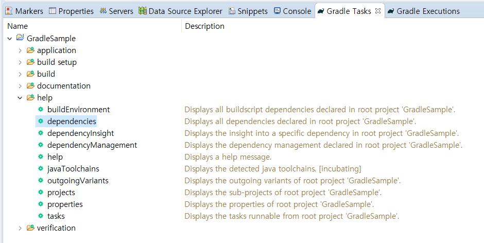

# 의존성 관리 이해

## 의존성 관리란?

> 프로젝트가 어떤 외부 라이브러리를 사용하고 있는지를 별도로 관리하는 것


```
장점
- 우리가 직접 관리할 의존성이 줄어든다.
- 버전을 명시할 필요가 없다.
```

### 의존성 관리/빌드 도구 종류

- pip : Python
- npm, yarn : node.js
- gem : Ruby
- ant, maven, gradle : java

도구 | 출시년도 | 언어 | 장점 
---|---|---|---
`Ant` | 2000 | xml | 유연한 구조적 장점 
`Maven` | 2004 | xml | 편리한 의존성 관리
`Gradle` | 2012 | Groovy | Ant + Maven

## Maven vs Gradle

### pom.xml vs build.gradle

```xml
<?xml version="1.0" encoding="UTF-8"?>
<project xmlns="http://maven.apache.org/POM/4.0.0" xmlns:xsi="http://www.w3.org/2001/XMLSchema-instance"
	xsi:schemaLocation="http://maven.apache.org/POM/4.0.0 https://maven.apache.org/xsd/maven-4.0.0.xsd">
	<modelVersion>4.0.0</modelVersion>
	<parent>
		<groupId>org.springframework.boot</groupId>
		<artifactId>spring-boot-starter-parent</artifactId>
		<version>2.4.4</version>
		<relativePath/> <!-- lookup parent from repository -->
	</parent>
	<groupId>kevin.springboot</groupId>
	<artifactId>MavenSample</artifactId>
	<version>0.0.1-SNAPSHOT</version>
	<name>MavenSample</name>
	<description>Maven sample project for Spring Boot</description>
	<properties>
		<java.version>1.8</java.version>
	</properties>
	<dependencies>
		<dependency>
			<groupId>org.springframework.boot</groupId>
			<artifactId>spring-boot-starter-web</artifactId>
		</dependency>

		<dependency>
			<groupId>org.springframework.boot</groupId>
			<artifactId>spring-boot-devtools</artifactId>
			<scope>runtime</scope>
			<optional>true</optional>
		</dependency>
		<dependency>
			<groupId>org.springframework.boot</groupId>
			<artifactId>spring-boot-starter-test</artifactId>
			<scope>test</scope>
		</dependency>
	</dependencies>

	<build>
		<plugins>
			<plugin>
				<groupId>org.springframework.boot</groupId>
				<artifactId>spring-boot-maven-plugin</artifactId>
			</plugin>
		</plugins>
	</build>
</project>
```

```java
plugins {
	id 'org.springframework.boot' version '2.4.4'
	id 'io.spring.dependency-management' version '1.0.11.RELEASE'
	id 'java'
}

group = 'kevin.springboot'
version = '0.0.1-SNAPSHOT'
sourceCompatibility = '1.8'

repositories {
	mavenCentral()
}

dependencies {
	implementation 'org.springframework.boot:spring-boot-starter-web'
	developmentOnly 'org.springframework.boot:spring-boot-devtools'
	testImplementation 'org.springframework.boot:spring-boot-starter-test'
}

test {
	useJUnitPlatform()
}
```

### parent pom in gradle

No parent pom in gradle

Build-by-convention을 바탕으로함.  그래서 스크립트 규모가 작고 읽기 쉬움

## gradle dependency 보는 법 (in Eclipse)



```
------------------------------------------------------------
Root project 'GradleSample'
------------------------------------------------------------

annotationProcessor - Annotation processors and their dependencies for source set 'main'.
No dependencies

apiElements - API elements for main. (n)
No dependencies

archives - Configuration for archive artifacts. (n)
No dependencies

bootArchives - Configuration for Spring Boot archive artifacts. (n)
No dependencies

compileClasspath - Compile classpath for source set 'main'.
\--- org.springframework.boot:spring-boot-starter-web -> 2.4.4
     +--- org.springframework.boot:spring-boot-starter:2.4.4
     |    +--- org.springframework.boot:spring-boot:2.4.4
     |    |    +--- org.springframework:spring-core:5.3.5
     |    |    |    \--- org.springframework:spring-jcl:5.3.5
     |    |    \--- org.springframework:spring-context:5.3.5
     |    |         +--- org.springframework:spring-aop:5.3.5
     |    |         |    +--- org.springframework:spring-beans:5.3.5
     |    |         |    |    \--- org.springframework:spring-core:5.3.5 (*)
     |    |         |    \--- org.springframework:spring-core:5.3.5 (*)
     |    |         +--- org.springframework:spring-beans:5.3.5 (*)
     |    |         +--- org.springframework:spring-core:5.3.5 (*)
     |    |         \--- org.springframework:spring-expression:5.3.5
     |    |              \--- org.springframework:spring-core:5.3.5 (*)
     |    +--- org.springframework.boot:spring-boot-autoconfigure:2.4.4
     |    |    \--- org.springframework.boot:spring-boot:2.4.4 (*)
     |    +--- org.springframework.boot:spring-boot-starter-logging:2.4.4
     |    |    +--- ch.qos.logback:logback-classic:1.2.3
     |    |    |    +--- ch.qos.logback:logback-core:1.2.3
     |    |    |    \--- org.slf4j:slf4j-api:1.7.25 -> 1.7.30
     |    |    +--- org.apache.logging.log4j:log4j-to-slf4j:2.13.3
     |    |    |    +--- org.slf4j:slf4j-api:1.7.25 -> 1.7.30
     |    |    |    \--- org.apache.logging.log4j:log4j-api:2.13.3
     |    |    \--- org.slf4j:jul-to-slf4j:1.7.30
     |    |         \--- org.slf4j:slf4j-api:1.7.30
     |    +--- jakarta.annotation:jakarta.annotation-api:1.3.5
     |    +--- org.springframework:spring-core:5.3.5 (*)
     |    \--- org.yaml:snakeyaml:1.27
     +--- org.springframework.boot:spring-boot-starter-json:2.4.4
     |    +--- org.springframework.boot:spring-boot-starter:2.4.4 (*)
     |    +--- org.springframework:spring-web:5.3.5
     |    |    +--- org.springframework:spring-beans:5.3.5 (*)
     |    |    \--- org.springframework:spring-core:5.3.5 (*)
     |    +--- com.fasterxml.jackson.core:jackson-databind:2.11.4
     |    |    +--- com.fasterxml.jackson.core:jackson-annotations:2.11.4
     |    |    \--- com.fasterxml.jackson.core:jackson-core:2.11.4
     |    +--- com.fasterxml.jackson.datatype:jackson-datatype-jdk8:2.11.4
     |    |    +--- com.fasterxml.jackson.core:jackson-core:2.11.4
     |    |    \--- com.fasterxml.jackson.core:jackson-databind:2.11.4 (*)
     |    +--- com.fasterxml.jackson.datatype:jackson-datatype-jsr310:2.11.4
     |    |    +--- com.fasterxml.jackson.core:jackson-annotations:2.11.4
     |    |    +--- com.fasterxml.jackson.core:jackson-core:2.11.4
     |    |    \--- com.fasterxml.jackson.core:jackson-databind:2.11.4 (*)
     |    \--- com.fasterxml.jackson.module:jackson-module-parameter-names:2.11.4
     |         +--- com.fasterxml.jackson.core:jackson-core:2.11.4
     |         \--- com.fasterxml.jackson.core:jackson-databind:2.11.4 (*)
     +--- org.springframework.boot:spring-boot-starter-tomcat:2.4.4
     |    +--- jakarta.annotation:jakarta.annotation-api:1.3.5
     |    +--- org.apache.tomcat.embed:tomcat-embed-core:9.0.44
     |    +--- org.glassfish:jakarta.el:3.0.3
     |    \--- org.apache.tomcat.embed:tomcat-embed-websocket:9.0.44
     |         \--- org.apache.tomcat.embed:tomcat-embed-core:9.0.44
     +--- org.springframework:spring-web:5.3.5 (*)
     \--- org.springframework:spring-webmvc:5.3.5
          +--- org.springframework:spring-aop:5.3.5 (*)
          +--- org.springframework:spring-beans:5.3.5 (*)
          +--- org.springframework:spring-context:5.3.5 (*)
          +--- org.springframework:spring-core:5.3.5 (*)
          +--- org.springframework:spring-expression:5.3.5 (*)
          \--- org.springframework:spring-web:5.3.5 (*)

compileOnly - Compile only dependencies for source set 'main'. (n)
No dependencies

default - Configuration for default artifacts. (n)
No dependencies

developmentOnly - Configuration for development-only dependencies such as Spring Boot's DevTools.
\--- org.springframework.boot:spring-boot-devtools -> 2.4.4
     +--- org.springframework.boot:spring-boot:2.4.4
     |    +--- org.springframework:spring-core:5.3.5
     |    |    \--- org.springframework:spring-jcl:5.3.5
     |    \--- org.springframework:spring-context:5.3.5
     |         +--- org.springframework:spring-aop:5.3.5
     |         |    +--- org.springframework:spring-beans:5.3.5
     |         |    |    \--- org.springframework:spring-core:5.3.5 (*)
     |         |    \--- org.springframework:spring-core:5.3.5 (*)
     |         +--- org.springframework:spring-beans:5.3.5 (*)
     |         +--- org.springframework:spring-core:5.3.5 (*)
     |         \--- org.springframework:spring-expression:5.3.5
     |              \--- org.springframework:spring-core:5.3.5 (*)
     \--- org.springframework.boot:spring-boot-autoconfigure:2.4.4
          \--- org.springframework.boot:spring-boot:2.4.4 (*)

implementation - Implementation only dependencies for source set 'main'. (n)
\--- org.springframework.boot:spring-boot-starter-web (n)

productionRuntimeClasspath
\--- org.springframework.boot:spring-boot-starter-web -> 2.4.4
     +--- org.springframework.boot:spring-boot-starter:2.4.4
     |    +--- org.springframework.boot:spring-boot:2.4.4
     |    |    +--- org.springframework:spring-core:5.3.5
     |    |    |    \--- org.springframework:spring-jcl:5.3.5
     |    |    \--- org.springframework:spring-context:5.3.5
     |    |         +--- org.springframework:spring-aop:5.3.5
     |    |         |    +--- org.springframework:spring-beans:5.3.5
     |    |         |    |    \--- org.springframework:spring-core:5.3.5 (*)
     |    |         |    \--- org.springframework:spring-core:5.3.5 (*)
     |    |         +--- org.springframework:spring-beans:5.3.5 (*)
     |    |         +--- org.springframework:spring-core:5.3.5 (*)
     |    |         \--- org.springframework:spring-expression:5.3.5
     |    |              \--- org.springframework:spring-core:5.3.5 (*)
     |    +--- org.springframework.boot:spring-boot-autoconfigure:2.4.4
     |    |    \--- org.springframework.boot:spring-boot:2.4.4 (*)
     |    +--- org.springframework.boot:spring-boot-starter-logging:2.4.4
     |    |    +--- ch.qos.logback:logback-classic:1.2.3
     |    |    |    +--- ch.qos.logback:logback-core:1.2.3
     |    |    |    \--- org.slf4j:slf4j-api:1.7.25 -> 1.7.30
     |    |    +--- org.apache.logging.log4j:log4j-to-slf4j:2.13.3
     |    |    |    +--- org.slf4j:slf4j-api:1.7.25 -> 1.7.30
     |    |    |    \--- org.apache.logging.log4j:log4j-api:2.13.3
     |    |    \--- org.slf4j:jul-to-slf4j:1.7.30
     |    |         \--- org.slf4j:slf4j-api:1.7.30
     |    +--- jakarta.annotation:jakarta.annotation-api:1.3.5
     |    +--- org.springframework:spring-core:5.3.5 (*)
     |    \--- org.yaml:snakeyaml:1.27
     +--- org.springframework.boot:spring-boot-starter-json:2.4.4
     |    +--- org.springframework.boot:spring-boot-starter:2.4.4 (*)
     |    +--- org.springframework:spring-web:5.3.5
     |    |    +--- org.springframework:spring-beans:5.3.5 (*)
     |    |    \--- org.springframework:spring-core:5.3.5 (*)
     |    +--- com.fasterxml.jackson.core:jackson-databind:2.11.4
     |    |    +--- com.fasterxml.jackson.core:jackson-annotations:2.11.4
     |    |    \--- com.fasterxml.jackson.core:jackson-core:2.11.4
     |    +--- com.fasterxml.jackson.datatype:jackson-datatype-jdk8:2.11.4
     |    |    +--- com.fasterxml.jackson.core:jackson-core:2.11.4
     |    |    \--- com.fasterxml.jackson.core:jackson-databind:2.11.4 (*)
     |    +--- com.fasterxml.jackson.datatype:jackson-datatype-jsr310:2.11.4
     |    |    +--- com.fasterxml.jackson.core:jackson-annotations:2.11.4
     |    |    +--- com.fasterxml.jackson.core:jackson-core:2.11.4
     |    |    \--- com.fasterxml.jackson.core:jackson-databind:2.11.4 (*)
     |    \--- com.fasterxml.jackson.module:jackson-module-parameter-names:2.11.4
     |         +--- com.fasterxml.jackson.core:jackson-core:2.11.4
     |         \--- com.fasterxml.jackson.core:jackson-databind:2.11.4 (*)
     +--- org.springframework.boot:spring-boot-starter-tomcat:2.4.4
     |    +--- jakarta.annotation:jakarta.annotation-api:1.3.5
     |    +--- org.apache.tomcat.embed:tomcat-embed-core:9.0.44
     |    +--- org.glassfish:jakarta.el:3.0.3
     |    \--- org.apache.tomcat.embed:tomcat-embed-websocket:9.0.44
     |         \--- org.apache.tomcat.embed:tomcat-embed-core:9.0.44
     +--- org.springframework:spring-web:5.3.5 (*)
     \--- org.springframework:spring-webmvc:5.3.5
          +--- org.springframework:spring-aop:5.3.5 (*)
          +--- org.springframework:spring-beans:5.3.5 (*)
          +--- org.springframework:spring-context:5.3.5 (*)
          +--- org.springframework:spring-core:5.3.5 (*)
          +--- org.springframework:spring-expression:5.3.5 (*)
          \--- org.springframework:spring-web:5.3.5 (*)

runtimeClasspath - Runtime classpath of source set 'main'.
+--- org.springframework.boot:spring-boot-devtools -> 2.4.4
|    +--- org.springframework.boot:spring-boot:2.4.4
|    |    +--- org.springframework:spring-core:5.3.5
|    |    |    \--- org.springframework:spring-jcl:5.3.5
|    |    \--- org.springframework:spring-context:5.3.5
|    |         +--- org.springframework:spring-aop:5.3.5
|    |         |    +--- org.springframework:spring-beans:5.3.5
|    |         |    |    \--- org.springframework:spring-core:5.3.5 (*)
|    |         |    \--- org.springframework:spring-core:5.3.5 (*)
|    |         +--- org.springframework:spring-beans:5.3.5 (*)
|    |         +--- org.springframework:spring-core:5.3.5 (*)
|    |         \--- org.springframework:spring-expression:5.3.5
|    |              \--- org.springframework:spring-core:5.3.5 (*)
|    \--- org.springframework.boot:spring-boot-autoconfigure:2.4.4
|         \--- org.springframework.boot:spring-boot:2.4.4 (*)
\--- org.springframework.boot:spring-boot-starter-web -> 2.4.4
     +--- org.springframework.boot:spring-boot-starter:2.4.4
     |    +--- org.springframework.boot:spring-boot:2.4.4 (*)
     |    +--- org.springframework.boot:spring-boot-autoconfigure:2.4.4 (*)
     |    +--- org.springframework.boot:spring-boot-starter-logging:2.4.4
     |    |    +--- ch.qos.logback:logback-classic:1.2.3
     |    |    |    +--- ch.qos.logback:logback-core:1.2.3
     |    |    |    \--- org.slf4j:slf4j-api:1.7.25 -> 1.7.30
     |    |    +--- org.apache.logging.log4j:log4j-to-slf4j:2.13.3
     |    |    |    +--- org.slf4j:slf4j-api:1.7.25 -> 1.7.30
     |    |    |    \--- org.apache.logging.log4j:log4j-api:2.13.3
     |    |    \--- org.slf4j:jul-to-slf4j:1.7.30
     |    |         \--- org.slf4j:slf4j-api:1.7.30
     |    +--- jakarta.annotation:jakarta.annotation-api:1.3.5
     |    +--- org.springframework:spring-core:5.3.5 (*)
     |    \--- org.yaml:snakeyaml:1.27
     +--- org.springframework.boot:spring-boot-starter-json:2.4.4
     |    +--- org.springframework.boot:spring-boot-starter:2.4.4 (*)
     |    +--- org.springframework:spring-web:5.3.5
     |    |    +--- org.springframework:spring-beans:5.3.5 (*)
     |    |    \--- org.springframework:spring-core:5.3.5 (*)
     |    +--- com.fasterxml.jackson.core:jackson-databind:2.11.4
     |    |    +--- com.fasterxml.jackson.core:jackson-annotations:2.11.4
     |    |    \--- com.fasterxml.jackson.core:jackson-core:2.11.4
     |    +--- com.fasterxml.jackson.datatype:jackson-datatype-jdk8:2.11.4
     |    |    +--- com.fasterxml.jackson.core:jackson-core:2.11.4
     |    |    \--- com.fasterxml.jackson.core:jackson-databind:2.11.4 (*)
     |    +--- com.fasterxml.jackson.datatype:jackson-datatype-jsr310:2.11.4
     |    |    +--- com.fasterxml.jackson.core:jackson-annotations:2.11.4
     |    |    +--- com.fasterxml.jackson.core:jackson-core:2.11.4
     |    |    \--- com.fasterxml.jackson.core:jackson-databind:2.11.4 (*)
     |    \--- com.fasterxml.jackson.module:jackson-module-parameter-names:2.11.4
     |         +--- com.fasterxml.jackson.core:jackson-core:2.11.4
     |         \--- com.fasterxml.jackson.core:jackson-databind:2.11.4 (*)
     +--- org.springframework.boot:spring-boot-starter-tomcat:2.4.4
     |    +--- jakarta.annotation:jakarta.annotation-api:1.3.5
     |    +--- org.apache.tomcat.embed:tomcat-embed-core:9.0.44
     |    +--- org.glassfish:jakarta.el:3.0.3
     |    \--- org.apache.tomcat.embed:tomcat-embed-websocket:9.0.44
     |         \--- org.apache.tomcat.embed:tomcat-embed-core:9.0.44
     +--- org.springframework:spring-web:5.3.5 (*)
     \--- org.springframework:spring-webmvc:5.3.5
          +--- org.springframework:spring-aop:5.3.5 (*)
          +--- org.springframework:spring-beans:5.3.5 (*)
          +--- org.springframework:spring-context:5.3.5 (*)
          +--- org.springframework:spring-core:5.3.5 (*)
          +--- org.springframework:spring-expression:5.3.5 (*)
          \--- org.springframework:spring-web:5.3.5 (*)

runtimeElements - Elements of runtime for main. (n)
No dependencies

runtimeOnly - Runtime only dependencies for source set 'main'. (n)
No dependencies

testAnnotationProcessor - Annotation processors and their dependencies for source set 'test'.
No dependencies

testCompileClasspath - Compile classpath for source set 'test'.
+--- org.springframework.boot:spring-boot-starter-web -> 2.4.4
|    +--- org.springframework.boot:spring-boot-starter:2.4.4
|    |    +--- org.springframework.boot:spring-boot:2.4.4
|    |    |    +--- org.springframework:spring-core:5.3.5
|    |    |    |    \--- org.springframework:spring-jcl:5.3.5
|    |    |    \--- org.springframework:spring-context:5.3.5
|    |    |         +--- org.springframework:spring-aop:5.3.5
|    |    |         |    +--- org.springframework:spring-beans:5.3.5
|    |    |         |    |    \--- org.springframework:spring-core:5.3.5 (*)
|    |    |         |    \--- org.springframework:spring-core:5.3.5 (*)
|    |    |         +--- org.springframework:spring-beans:5.3.5 (*)
|    |    |         +--- org.springframework:spring-core:5.3.5 (*)
|    |    |         \--- org.springframework:spring-expression:5.3.5
|    |    |              \--- org.springframework:spring-core:5.3.5 (*)
|    |    +--- org.springframework.boot:spring-boot-autoconfigure:2.4.4
|    |    |    \--- org.springframework.boot:spring-boot:2.4.4 (*)
|    |    +--- org.springframework.boot:spring-boot-starter-logging:2.4.4
|    |    |    +--- ch.qos.logback:logback-classic:1.2.3
|    |    |    |    +--- ch.qos.logback:logback-core:1.2.3
|    |    |    |    \--- org.slf4j:slf4j-api:1.7.25 -> 1.7.30
|    |    |    +--- org.apache.logging.log4j:log4j-to-slf4j:2.13.3
|    |    |    |    +--- org.slf4j:slf4j-api:1.7.25 -> 1.7.30
|    |    |    |    \--- org.apache.logging.log4j:log4j-api:2.13.3
|    |    |    \--- org.slf4j:jul-to-slf4j:1.7.30
|    |    |         \--- org.slf4j:slf4j-api:1.7.30
|    |    +--- jakarta.annotation:jakarta.annotation-api:1.3.5
|    |    +--- org.springframework:spring-core:5.3.5 (*)
|    |    \--- org.yaml:snakeyaml:1.27
|    +--- org.springframework.boot:spring-boot-starter-json:2.4.4
|    |    +--- org.springframework.boot:spring-boot-starter:2.4.4 (*)
|    |    +--- org.springframework:spring-web:5.3.5
|    |    |    +--- org.springframework:spring-beans:5.3.5 (*)
|    |    |    \--- org.springframework:spring-core:5.3.5 (*)
|    |    +--- com.fasterxml.jackson.core:jackson-databind:2.11.4
|    |    |    +--- com.fasterxml.jackson.core:jackson-annotations:2.11.4
|    |    |    \--- com.fasterxml.jackson.core:jackson-core:2.11.4
|    |    +--- com.fasterxml.jackson.datatype:jackson-datatype-jdk8:2.11.4
|    |    |    +--- com.fasterxml.jackson.core:jackson-core:2.11.4
|    |    |    \--- com.fasterxml.jackson.core:jackson-databind:2.11.4 (*)
|    |    +--- com.fasterxml.jackson.datatype:jackson-datatype-jsr310:2.11.4
|    |    |    +--- com.fasterxml.jackson.core:jackson-annotations:2.11.4
|    |    |    +--- com.fasterxml.jackson.core:jackson-core:2.11.4
|    |    |    \--- com.fasterxml.jackson.core:jackson-databind:2.11.4 (*)
|    |    \--- com.fasterxml.jackson.module:jackson-module-parameter-names:2.11.4
|    |         +--- com.fasterxml.jackson.core:jackson-core:2.11.4
|    |         \--- com.fasterxml.jackson.core:jackson-databind:2.11.4 (*)
|    +--- org.springframework.boot:spring-boot-starter-tomcat:2.4.4
|    |    +--- jakarta.annotation:jakarta.annotation-api:1.3.5
|    |    +--- org.apache.tomcat.embed:tomcat-embed-core:9.0.44
|    |    +--- org.glassfish:jakarta.el:3.0.3
|    |    \--- org.apache.tomcat.embed:tomcat-embed-websocket:9.0.44
|    |         \--- org.apache.tomcat.embed:tomcat-embed-core:9.0.44
|    +--- org.springframework:spring-web:5.3.5 (*)
|    \--- org.springframework:spring-webmvc:5.3.5
|         +--- org.springframework:spring-aop:5.3.5 (*)
|         +--- org.springframework:spring-beans:5.3.5 (*)
|         +--- org.springframework:spring-context:5.3.5 (*)
|         +--- org.springframework:spring-core:5.3.5 (*)
|         +--- org.springframework:spring-expression:5.3.5 (*)
|         \--- org.springframework:spring-web:5.3.5 (*)
\--- org.springframework.boot:spring-boot-starter-test -> 2.4.4
     +--- org.springframework.boot:spring-boot-starter:2.4.4 (*)
     +--- org.springframework.boot:spring-boot-test:2.4.4
     |    \--- org.springframework.boot:spring-boot:2.4.4 (*)
     +--- org.springframework.boot:spring-boot-test-autoconfigure:2.4.4
     |    +--- org.springframework.boot:spring-boot:2.4.4 (*)
     |    +--- org.springframework.boot:spring-boot-test:2.4.4 (*)
     |    \--- org.springframework.boot:spring-boot-autoconfigure:2.4.4 (*)
     +--- com.jayway.jsonpath:json-path:2.4.0
     |    +--- net.minidev:json-smart:2.3
     |    |    \--- net.minidev:accessors-smart:1.2
     |    |         \--- org.ow2.asm:asm:5.0.4
     |    \--- org.slf4j:slf4j-api:1.7.25 -> 1.7.30
     +--- jakarta.xml.bind:jakarta.xml.bind-api:2.3.3
     |    \--- jakarta.activation:jakarta.activation-api:1.2.2
     +--- org.assertj:assertj-core:3.18.1
     +--- org.hamcrest:hamcrest:2.2
     +--- org.junit.jupiter:junit-jupiter:5.7.1
     |    +--- org.junit:junit-bom:5.7.1
     |    |    +--- org.junit.jupiter:junit-jupiter:5.7.1 (c)
     |    |    +--- org.junit.jupiter:junit-jupiter-api:5.7.1 (c)
     |    |    +--- org.junit.jupiter:junit-jupiter-params:5.7.1 (c)
     |    |    \--- org.junit.platform:junit-platform-commons:1.7.1 (c)
     |    +--- org.junit.jupiter:junit-jupiter-api:5.7.1
     |    |    +--- org.junit:junit-bom:5.7.1 (*)
     |    |    +--- org.apiguardian:apiguardian-api:1.1.0
     |    |    +--- org.opentest4j:opentest4j:1.2.0
     |    |    \--- org.junit.platform:junit-platform-commons:1.7.1
     |    |         +--- org.junit:junit-bom:5.7.1 (*)
     |    |         \--- org.apiguardian:apiguardian-api:1.1.0
     |    \--- org.junit.jupiter:junit-jupiter-params:5.7.1
     |         +--- org.junit:junit-bom:5.7.1 (*)
     |         +--- org.apiguardian:apiguardian-api:1.1.0
     |         \--- org.junit.jupiter:junit-jupiter-api:5.7.1 (*)
     +--- org.mockito:mockito-core:3.6.28
     |    +--- net.bytebuddy:byte-buddy:1.10.18 -> 1.10.22
     |    +--- net.bytebuddy:byte-buddy-agent:1.10.18 -> 1.10.22
     |    \--- org.objenesis:objenesis:3.1
     +--- org.mockito:mockito-junit-jupiter:3.6.28
     |    \--- org.mockito:mockito-core:3.6.28 (*)
     +--- org.skyscreamer:jsonassert:1.5.0
     |    \--- com.vaadin.external.google:android-json:0.0.20131108.vaadin1
     +--- org.springframework:spring-core:5.3.5 (*)
     +--- org.springframework:spring-test:5.3.5
     |    \--- org.springframework:spring-core:5.3.5 (*)
     \--- org.xmlunit:xmlunit-core:2.7.0

testCompileOnly - Compile only dependencies for source set 'test'. (n)
No dependencies

testImplementation - Implementation only dependencies for source set 'test'. (n)
\--- org.springframework.boot:spring-boot-starter-test (n)

testRuntimeClasspath - Runtime classpath of source set 'test'.
+--- org.springframework.boot:spring-boot-starter-web -> 2.4.4
|    +--- org.springframework.boot:spring-boot-starter:2.4.4
|    |    +--- org.springframework.boot:spring-boot:2.4.4
|    |    |    +--- org.springframework:spring-core:5.3.5
|    |    |    |    \--- org.springframework:spring-jcl:5.3.5
|    |    |    \--- org.springframework:spring-context:5.3.5
|    |    |         +--- org.springframework:spring-aop:5.3.5
|    |    |         |    +--- org.springframework:spring-beans:5.3.5
|    |    |         |    |    \--- org.springframework:spring-core:5.3.5 (*)
|    |    |         |    \--- org.springframework:spring-core:5.3.5 (*)
|    |    |         +--- org.springframework:spring-beans:5.3.5 (*)
|    |    |         +--- org.springframework:spring-core:5.3.5 (*)
|    |    |         \--- org.springframework:spring-expression:5.3.5
|    |    |              \--- org.springframework:spring-core:5.3.5 (*)
|    |    +--- org.springframework.boot:spring-boot-autoconfigure:2.4.4
|    |    |    \--- org.springframework.boot:spring-boot:2.4.4 (*)
|    |    +--- org.springframework.boot:spring-boot-starter-logging:2.4.4
|    |    |    +--- ch.qos.logback:logback-classic:1.2.3
|    |    |    |    +--- ch.qos.logback:logback-core:1.2.3
|    |    |    |    \--- org.slf4j:slf4j-api:1.7.25 -> 1.7.30
|    |    |    +--- org.apache.logging.log4j:log4j-to-slf4j:2.13.3
|    |    |    |    +--- org.slf4j:slf4j-api:1.7.25 -> 1.7.30
|    |    |    |    \--- org.apache.logging.log4j:log4j-api:2.13.3
|    |    |    \--- org.slf4j:jul-to-slf4j:1.7.30
|    |    |         \--- org.slf4j:slf4j-api:1.7.30
|    |    +--- jakarta.annotation:jakarta.annotation-api:1.3.5
|    |    +--- org.springframework:spring-core:5.3.5 (*)
|    |    \--- org.yaml:snakeyaml:1.27
|    +--- org.springframework.boot:spring-boot-starter-json:2.4.4
|    |    +--- org.springframework.boot:spring-boot-starter:2.4.4 (*)
|    |    +--- org.springframework:spring-web:5.3.5
|    |    |    +--- org.springframework:spring-beans:5.3.5 (*)
|    |    |    \--- org.springframework:spring-core:5.3.5 (*)
|    |    +--- com.fasterxml.jackson.core:jackson-databind:2.11.4
|    |    |    +--- com.fasterxml.jackson.core:jackson-annotations:2.11.4
|    |    |    \--- com.fasterxml.jackson.core:jackson-core:2.11.4
|    |    +--- com.fasterxml.jackson.datatype:jackson-datatype-jdk8:2.11.4
|    |    |    +--- com.fasterxml.jackson.core:jackson-core:2.11.4
|    |    |    \--- com.fasterxml.jackson.core:jackson-databind:2.11.4 (*)
|    |    +--- com.fasterxml.jackson.datatype:jackson-datatype-jsr310:2.11.4
|    |    |    +--- com.fasterxml.jackson.core:jackson-annotations:2.11.4
|    |    |    +--- com.fasterxml.jackson.core:jackson-core:2.11.4
|    |    |    \--- com.fasterxml.jackson.core:jackson-databind:2.11.4 (*)
|    |    \--- com.fasterxml.jackson.module:jackson-module-parameter-names:2.11.4
|    |         +--- com.fasterxml.jackson.core:jackson-core:2.11.4
|    |         \--- com.fasterxml.jackson.core:jackson-databind:2.11.4 (*)
|    +--- org.springframework.boot:spring-boot-starter-tomcat:2.4.4
|    |    +--- jakarta.annotation:jakarta.annotation-api:1.3.5
|    |    +--- org.apache.tomcat.embed:tomcat-embed-core:9.0.44
|    |    +--- org.glassfish:jakarta.el:3.0.3
|    |    \--- org.apache.tomcat.embed:tomcat-embed-websocket:9.0.44
|    |         \--- org.apache.tomcat.embed:tomcat-embed-core:9.0.44
|    +--- org.springframework:spring-web:5.3.5 (*)
|    \--- org.springframework:spring-webmvc:5.3.5
|         +--- org.springframework:spring-aop:5.3.5 (*)
|         +--- org.springframework:spring-beans:5.3.5 (*)
|         +--- org.springframework:spring-context:5.3.5 (*)
|         +--- org.springframework:spring-core:5.3.5 (*)
|         +--- org.springframework:spring-expression:5.3.5 (*)
|         \--- org.springframework:spring-web:5.3.5 (*)
\--- org.springframework.boot:spring-boot-starter-test -> 2.4.4
     +--- org.springframework.boot:spring-boot-starter:2.4.4 (*)
     +--- org.springframework.boot:spring-boot-test:2.4.4
     |    \--- org.springframework.boot:spring-boot:2.4.4 (*)
     +--- org.springframework.boot:spring-boot-test-autoconfigure:2.4.4
     |    +--- org.springframework.boot:spring-boot:2.4.4 (*)
     |    +--- org.springframework.boot:spring-boot-test:2.4.4 (*)
     |    \--- org.springframework.boot:spring-boot-autoconfigure:2.4.4 (*)
     +--- com.jayway.jsonpath:json-path:2.4.0
     |    +--- net.minidev:json-smart:2.3
     |    |    \--- net.minidev:accessors-smart:1.2
     |    |         \--- org.ow2.asm:asm:5.0.4
     |    \--- org.slf4j:slf4j-api:1.7.25 -> 1.7.30
     +--- jakarta.xml.bind:jakarta.xml.bind-api:2.3.3
     |    \--- jakarta.activation:jakarta.activation-api:1.2.2
     +--- org.assertj:assertj-core:3.18.1
     +--- org.hamcrest:hamcrest:2.2
     +--- org.junit.jupiter:junit-jupiter:5.7.1
     |    +--- org.junit:junit-bom:5.7.1
     |    |    +--- org.junit.jupiter:junit-jupiter:5.7.1 (c)
     |    |    +--- org.junit.jupiter:junit-jupiter-api:5.7.1 (c)
     |    |    +--- org.junit.jupiter:junit-jupiter-engine:5.7.1 (c)
     |    |    +--- org.junit.jupiter:junit-jupiter-params:5.7.1 (c)
     |    |    +--- org.junit.platform:junit-platform-commons:1.7.1 (c)
     |    |    \--- org.junit.platform:junit-platform-engine:1.7.1 (c)
     |    +--- org.junit.jupiter:junit-jupiter-api:5.7.1
     |    |    +--- org.junit:junit-bom:5.7.1 (*)
     |    |    +--- org.apiguardian:apiguardian-api:1.1.0
     |    |    +--- org.opentest4j:opentest4j:1.2.0
     |    |    \--- org.junit.platform:junit-platform-commons:1.7.1
     |    |         +--- org.junit:junit-bom:5.7.1 (*)
     |    |         \--- org.apiguardian:apiguardian-api:1.1.0
     |    +--- org.junit.jupiter:junit-jupiter-params:5.7.1
     |    |    +--- org.junit:junit-bom:5.7.1 (*)
     |    |    +--- org.apiguardian:apiguardian-api:1.1.0
     |    |    \--- org.junit.jupiter:junit-jupiter-api:5.7.1 (*)
     |    \--- org.junit.jupiter:junit-jupiter-engine:5.7.1
     |         +--- org.junit:junit-bom:5.7.1 (*)
     |         +--- org.apiguardian:apiguardian-api:1.1.0
     |         +--- org.junit.platform:junit-platform-engine:1.7.1
     |         |    +--- org.junit:junit-bom:5.7.1 (*)
     |         |    +--- org.apiguardian:apiguardian-api:1.1.0
     |         |    +--- org.opentest4j:opentest4j:1.2.0
     |         |    \--- org.junit.platform:junit-platform-commons:1.7.1 (*)
     |         \--- org.junit.jupiter:junit-jupiter-api:5.7.1 (*)
     +--- org.mockito:mockito-core:3.6.28
     |    +--- net.bytebuddy:byte-buddy:1.10.18 -> 1.10.22
     |    +--- net.bytebuddy:byte-buddy-agent:1.10.18 -> 1.10.22
     |    \--- org.objenesis:objenesis:3.1
     +--- org.mockito:mockito-junit-jupiter:3.6.28
     |    +--- org.mockito:mockito-core:3.6.28 (*)
     |    \--- org.junit.jupiter:junit-jupiter-api:5.4.2 -> 5.7.1 (*)
     +--- org.skyscreamer:jsonassert:1.5.0
     |    \--- com.vaadin.external.google:android-json:0.0.20131108.vaadin1
     +--- org.springframework:spring-core:5.3.5 (*)
     +--- org.springframework:spring-test:5.3.5
     |    \--- org.springframework:spring-core:5.3.5 (*)
     \--- org.xmlunit:xmlunit-core:2.7.0

testRuntimeOnly - Runtime only dependencies for source set 'test'. (n)
No dependencies

(c) - dependency constraint
(*) - dependencies omitted (listed previously)

(n) - Not resolved (configuration is not meant to be resolved)

A web-based, searchable dependency report is available by adding the --scan option.

BUILD SUCCESSFUL in 1s
1 actionable task: 1 executed

```

