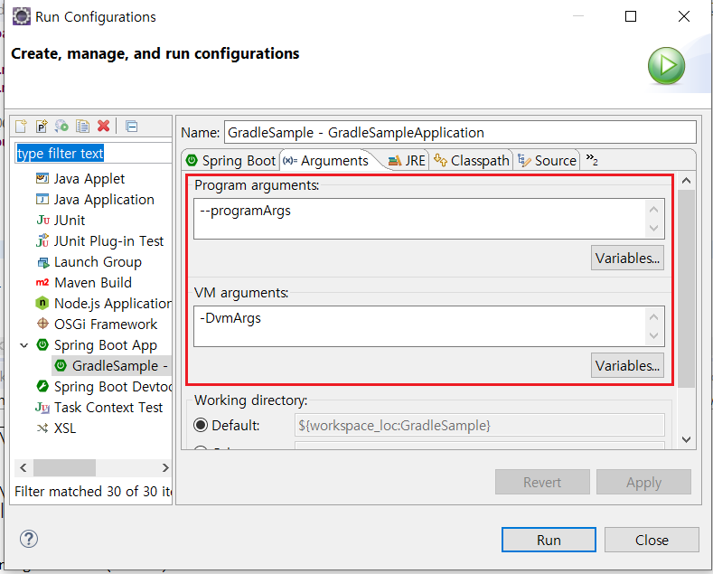

# SpringApplication 

Spring boot applicaiton을 실행하는 방법

```java
// Static method를 쓰는 방법으로 customizing 할 수 없다.
@SpringBootApplication
public class PfApplication {
	public static void main(String[] args) {
		SpringApplication.run(PfApplication.class, args);
	}
}
```

```java
// 위의 방법과 동일한 효과지만 pfApp 인스턴스 생성과 run 사이에 customizing이 가능하다.
@SpringBootApplication
public class PfApplication {
	public static void main(String[] args) {
		SpringApplication pfApp = new SpringApplication(PfApplication.class); 
        	// pfApp.setWebApplicationType(WebApplicationType.NONE);
        	pfApp.run(args);
	}
}
```

## SpringApplicationBuilder

계층 관계 Application을 생성해야 하거나 'fluent' builder API를 사용하는 것을 선호한다면 SpringApplicationBuilder를 사용할 수 있다.

SpringApplicationBuilder는 여러 메소드 호출을 연결해서 method chain 할 수 있게 하고 

```java
new SpringApplicationBuilder()
               .sources(Parent.class)
               .child(Application.class)
               .bannerMode(Banner.Mode.OFF)
               .run(args);
```


계층 관계를 만들 수 있는 parent와 child 메소드를 포함하고 있다.

```java
SpringApplicationBuilder appBuilder = new SpringApplicationBuilder()
        .sources(Parent.class);

appBuilder.child(Application1.class).run(args);
appBuilder.child(Application2.class).run(args);
```


## ApplicationEvent

Spring에는 기본적으로 제공하는 이벤트들이 있다.

|Event|실행 시점|순서|비고|
|---|---|---|---|
|ApplicationStartingEvent|Environment 또는 ApplicationContext가 사용 가능하기 전 SpringApplication이 시작되자마자 실행되는 이벤트|1|app.addListeners()|
|ApplicationEnvironmentPreparedEvent|SpringApplication이 시작되고 환경이 처음으로 검사 및 수정할 수 있을 때|2|app.addListeners()|
|ApplicationContextInitializedEvent|SpringApplication이 시작되고 ApplicationContext가 준비되고 ApplicationContextInitializer가 호출되었지만 Bean은 아직 로드되기 전에|3|app.addListeners()|
|ApplicationPreparedEvent|SpringApplication이 시작되고 ApplicationContext가 완전히 준비되었지만 새로 고쳐지지 않은 시점. Bean이 로드된 후이다.|4|app.addListeners()|
|ApplicationStartedEvent|애플리케이션 컨텍스트가 새로 고쳐졌지만 애플리케이션 및 명령 줄 실행기가 호출되기 전에 게시된 이벤트|5|Bean 등록만으로 가능|
|ApplicationReadyEvent|애플리케이션이 요청을 처리할 준비가 되었음을 나타 내기 위해 가능한 한 늦게 게시되는 이벤트|6|Bean 등록만으로 가능|
|ApplicationFailedEvent|시작에 실패할 때|||

<pre>
### ApplicationStartingEvent ###
### ApplicationEnvironmentPreparedEvent ###

 ________     ___    ___             ________  ________ 
|\   __  \   |\  \  /  /|           |\   __  \|\  _____\
\ \  \|\ /_  \ \  \/  / /___________\ \  \|\  \ \  \__/ 
 \ \   __  \  \ \    / /\____________\ \   ____\ \   __\
  \ \  \|\  \  /     \/\|____________|\ \  \___|\ \  \_|
   \ \_______\/  /\   \                \ \__\    \ \__\ 
    \|_______/__/ /\ __\                \|__|     \|__| 
             |__|/ \|__|                                
             
:: Spring Boot :: (v2.4.4)

### ApplicationContextInitializedEvent ###
2021-04-05 06:49:29.508  INFO 174204 --- [  restartedMain] k.s.sample.GradleSampleApplication       : Starting GradleSampleApplication using Java 1.8.0_151 on DESKTOP-HPVS9RB with PID 174204 (D:\99.KYLEE\01.개인프로젝트\59.Study\study\Spring Boot\workspace\GradleSample\bin\main started by kylee in D:\99.KYLEE\01.개인프로젝트\59.Study\study\Spring Boot\workspace\GradleSample)
2021-04-05 06:49:29.511  INFO 174204 --- [  restartedMain] k.s.sample.GradleSampleApplication       : No active profile set, falling back to default profiles: default
2021-04-05 06:49:29.589  INFO 174204 --- [  restartedMain] .e.DevToolsPropertyDefaultsPostProcessor : Devtools property defaults active! Set 'spring.devtools.add-properties' to 'false' to disable
### ApplicationPreparedEvent ###
2021-04-05 06:49:30.300  INFO 174204 --- [  restartedMain] o.s.b.d.a.OptionalLiveReloadServer       : LiveReload server is running on port 35729
2021-04-05 06:49:30.318  INFO 174204 --- [  restartedMain] k.s.sample.GradleSampleApplication       : Started GradleSampleApplication in 1.167 seconds (JVM running for 4.053)
### ApplicationStartedEvent ###
### ApplicationReadyEvent ###
</pre>


### ApplicationEvent 등록

기본적으로 ApplicationListener가 구현된 bean은 spring boot가 알아서 listener type에 맞는 시점에 실행시켜준다.

```java
@Component
public class ApplicationStartedEventListner implements ApplicationListener<ApplicationStartedEvent>{

	@Override
	public void onApplicationEvent(ApplicationStartedEvent event) {
		System.out.println("### ApplicationStartedEvent ###");
	}
}
```

하지만 Spring의 6개 이벤트 중 ApplicationContext가 만들어지기 전에 실행되는 4개의 이벤트는 listener를 @Bean으로 등록할 수 없다.

그래서 아래처럼 addListeners()를 통해 직접 등록해 줘야 한다.

```java
public static void main(String[] args) {
    SpringApplication app = new SpringApplication(GradleSampleApplication.class);
    app.addListeners(new ApplicationContextInitializedEventListner());
    app.addListeners(new ApplicationEnvironmentPreparedEventListner());
    app.addListeners(new ApplicationFailedEventListner());
    app.addListeners(new ApplicationPreparedEventListner());
    app.addListeners(new ApplicationStartingEventListner());
    app.run(args);
}
```


## Application의 타입 설정

```java
@SpringBootApplication
public class GradleSampleApplication {
	public static void main(String[] args) {
		SpringApplication app = new SpringApplication(GradleSampleApplication.class);
		app.setWebApplicationType(WebApplicationType.NONE); // SERVLET, REACTIVE, NONE
		app.run(args);
	}
}
```

의존성에 Spring MVC가 들어있으면 기본적으로 무조건 SERVLET 타입,
Spring WebFlux만 들어있으면 기본적으로 REACTIVE 타입,
둘 다 없는 경우는 NONE 타입으로 돈다.


## Application Argument

Applicaion 기동 시 사용할 수 있는 arguments 2가지 방법

- Program arguments : --로 시작하는 option
- JVM arguments : -D로 시작하는 option 예) -Ddata_source=java:comp/env/jdbc/pfDistDB



```java
@Component
public class ArgumentTest {

	// Bean의 생성자가 하나만 있고 생성자의 input이 Bean 이면 spring이 자동으로 해당 bean을 주입 해준다.
	public ArgumentTest(ApplicationArguments args) {
	}
}

```

## ApplicationRunner

Application을 실행하고 난 후, 뭔가를 실행하고 싶을 때 사용한다.

```java
@Component
@Order(1)   // Runner 간의 순서 정의 가능
public class FirstRunner implements ApplicationRunner {

    // ApplicationArguments가 input으로 들어오기 때문에 application의 args를 사용할 수 있다.
	@Override
	public void run(ApplicationArguments args) throws Exception {
		System.out.println("### FirstRunner");
	}
}
```


## 배너

- banner.txt | gif | jpg | png
- classpath 또는 spring.banner.location로 위치 지정 가능
- ${spring-boot.version} 등의 변수를 사용할 수 있음
- Banner 클래스 구현하고 SpringApplication.setBanner()로 설정 가능

http://patorjk.com/software/taag/#p=display&f=Graffiti&t=Type%20Something%20

https://devops.datenkollektiv.de/banner.txt/index.html


### Spring Boot 공식 참조 문서

> https://docs.spring.io/spring-boot/docs/current/reference/html/boot-features-spring-application.html#boot-features-spring-application
